<!-- 👋 github.com/submarinejuice -->

<table border="0" cellspacing="0" cellpadding="0">
<tr>
<td width="320" valign="middle">

</td>
<td valign="top" style="padding-left: 20px;">
<code>// PORTFOLIO · michellechala.vercel.app</code> 

<h2>Michelle Chala</h2>
  
<code>∷ MSS-01 DISCOVERY · COMMANDER · ONLINE ∷ https://michellechala.vercel.app</code>

CS & Psychology @ Wilfrid Laurier

<code>> NOW TRANSMITTING</code>

</td>
</tr>
</table>

---

### 🧰 Tech Stack

  
  
  
  
  

  
  
  
  
  
  

---

### 🎓 Education

**Wilfrid Laurier University** — Honours BSc Computer Science & Psychology + Business Management Option  
*Concentration: Computational Cognitive Neuroscience · Thesis: ML Analysis of fMRI Networks in Children*

---

### ⚡ Fun Facts

- 🧩 Synesthetic thinker — I visualize data patterns and algorithms as colors and shapes
- ☕ Usually running on caffeine, deep learning papers, Jazz playlists, and a passion for photography
- 🐱 Proud cat-mom · photographer · neurophilosophy literature lover
